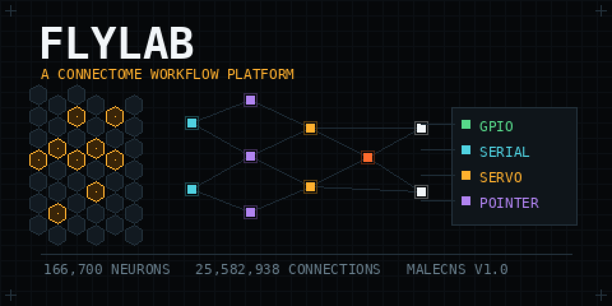

# FLYLAB

A fly's reconstructed nervous system, wired to a computer's inputs and outputs, doing whatever you draw on a canvas.

The **retained MaleCNS v1.0 graph — 166,700 neurons, 25.6 million connections** — sits between what this machine can sense and what it can drive. You decide what reaches which cells, how long the network runs, and what its activity does next. Screenshots and camera frames go into the photoreceptors. Distance sensors go into mechanosensory cells. The descending neurons a fly walks with come back out as GPIO pins, serial commands, servo angles and pointer movements.

**What is and is not modelled:** the connectome supplies anatomy. It does not supply dynamics, receptor identity, most neuromodulation, or behaviour. Teaching pulses are engineered current injections into identified dopaminergic cells — not rewards, not punishments, and nothing is experienced. No useful learning has been demonstrated. [Model and evidence](docs/model.md).

## Run it

Python 3.11, a C++17 compiler, macOS/Linux/Raspberry Pi. Allow several GB for the dataset; 16 GB RAM recommended for the full release.

```sh
python3 -m venv .venv
source .venv/bin/activate
pip install -r requirements.txt
python3 startup.py
```

`startup.py` checks the machine, reports anything missing in plain language, starts the interface and opens a browser. It listens on port **8765** on every interface, so it is reachable both at `http://127.0.0.1:8765/` and at this machine's own address on your network — the banner prints both. See [over the network](#over-the-network) before putting it somewhere you do not control. `python3 startup.py --check` runs the checks and stops.

To try the software before downloading 1.1 GB, `python3 startup.py --fixture` builds a small randomly wired test graph with the same shape. Everything works; every number it produces is labelled synthetic, because it is.

For the real thing, open **Housekeeping** and press *Download and prepare*. Three released files are fetched, checked against SHA-256 locks committed here, normalised and compiled. Then load it from **Status**.

## What the interface does

| Page | What it is for |
| --- | --- |
| **Status** | What is loaded, what this machine can reach, what ran last |
| **Projects** | Saved work: a workflow, its settings, and the model it resumes from |
| **Workflow** | The node canvas: 70 block types across inputs, vision, encoding, the network, readouts, logic, outputs, and goals |
| **Network** | Live activity across the whole graph, and every one of its 54 named channels |
| **Bench** | Drive one channel, read another, test hardware — without running a workflow |
| **Training** | Training schedules, and the controls any learning claim has to be compared against |
| **Models** | Label, annotate and reload what the network has learned |
| **Housekeeping** | Download, verify, build the fixture, check dependencies |
| **Settings** | Session and run defaults, interface options, and who may reach this interface |

Every control describes itself on hover: the technical term, what it literally does, and what happens when you use it.

## What can go in and come out

Sensory channels address the real cells by their published type annotations: R1–R6 brightness, R7 ultraviolet, R8 colour, ocelli, olfactory receptor neurons, sugar and bitter taste, Johnston's organ, bristle mechanoreceptors, femoral chordotonal organs, campaniform sensilla, thermo- and hygrosensors, nociceptors, ascending neurons. Readouts address descending neurons, leg, wing, neck and proboscis motor neurons, mushroom-body output neurons, and the central complex's heading and steering populations. Teaching signals go to PAM and PPL1 dopaminergic clusters, octopaminergic and serotonergic cells.

Devices: screen regions, cameras, video and image files, headless web pages, microphones, serial ports, Raspberry Pi GPIO (digital in and out, PWM, servos, HC-SR04 range finders, edge waiting), the mouse and keyboard, HTTP, UDP, MQTT, files.

A channel that is absent from the loaded dataset is reported as absent. A device that is not installed names the package that would install it. Nothing is invented to fill a gap.

## Over the network

**FLYLAB is shared on your local network by default.** It listens on every interface, and the start-up banner prints the address to open from a phone or another computer:

```
  Open from any device on this network:
      http://192.168.1.42:8765/
  On this machine:  http://127.0.0.1:8765/
```

That is the useful default for the machine this usually runs on — a headless Raspberry Pi wired to a robot, driven from a laptop across the room. It is also a real exposure: **no access key is required, and this interface can drive GPIO pins, move the pointer and start programs on the host.** Anyone who can reach that address can do those things.

Two ways to close it down, both enforced at the socket *and* on every request:

```sh
python3 startup.py --local-only   # bind loopback; refuse everything else
python3 startup.py --key          # stay shared, but require a key in the address
```

Settings → *Who can reach this interface* does the same thing while it is running, shows the address to share, and copies it to the clipboard. Switching to local-only locks out remote devices immediately, without a restart.

```sh
python3 -m flylab devices         # what hardware this machine can reach
python3 -m flylab verify          # re-check a prepared dataset
python3 -m pytest -q              # 119 tests, no dataset needed
```

The repository ships no data and contacts no service on your behalf. Projects, models and settings live in `~/.flylab` as plain JSON beside their files.
